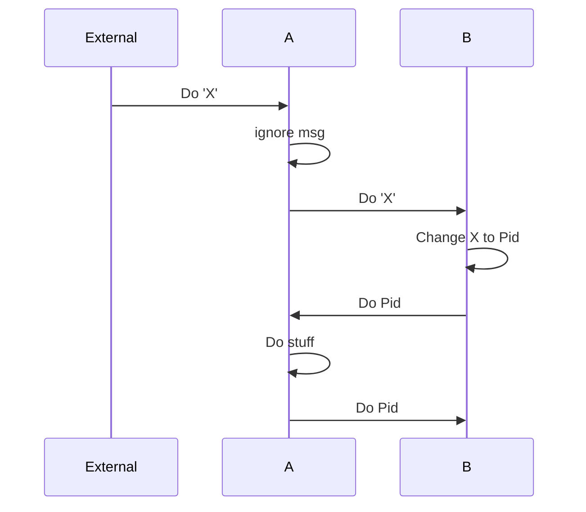

EGRE - Erlang Graph Rules Engine

EGRE has been split off from GERLSHMUD; GERLSHMUD is a MUD built in
Erlang with a graph rules engine. EGRE is that rules engine.

The original goal of GERLSHMUD, then called erlmud (which conflicted with zxq9's
MUD of the same name), was to create a MUD where every element of the MUD was an
independent process running concurrently with all other processes. That is,
there's no "manager" processes to handle coordinating between processes
to fetch data or handle events atomically. The idea of a graph rules engine
sprang up organically as I tried to figure out how to communicate between
processes asynchronously. I stumbled upon the idea of having processes
communicate by "passing notes": messages can be modified to add requests for
more information and then run through the graph again. The name GERLSHMUD was
based on the idea of "stream handlers", but the messages aren't really from a
stream, their generated by in-game events. I don't call them events so as not
to confuse player input, which is a message to the MUD, with an event that is
caused by player input, or an event that is generated by the MUD itself.

So, EGRE is a graph of asynchronous processes handling messages.
Messages flow through the graph and touch one process at a time.
Each process takes in messages, modifies its internal state and either
passes on the message or triggers one or more new messages.

Any message is first proposed as an attempt that will succeed or fail. Attempts are passed
from process to process through the graph.  Each process can either fail the
attempt with a reason or allow the attempt to succeed. Each process can also
subscribe to the message to be notified of the result. Processes can also resend
a different attempt in place of an original or pass on a modified copy of the
original. If an attempt traverses all connected nodes without failing, it succeeds.

It's important to first "attempt" to process a message so that processes can
mark the message as invalid before any action takes place. This is especially
true for player input that makes no sense, e.g. "go north" when there is no
north; we don't want processes reacting to the player "going north" when it
wasn't possible in the first place. If a message attempt succeeds, then the
player "went north"; any interested process will have subscribed to "go north"
to see if it actually happens or even if it fails.

Messages flow through the graph without locking up other processes.
Each process that handles the message will handle it independently of all other
processes. A process always has the only copy of the message and no locks are
needed. No process will halt processing to communicate with another process.
This means that all information about each message must be contained in the message
itself.

Since processes do not communicate directly, and since all processes
receive all (nearby) messages, any process can be added anywhere in the
graph and begin to participate in every (nearby) message. Each process
listens for particluar messages and so processes that cooperate to resolve
a message will need to agree on a protocol to communicate via the process
graph.

There are no "transactions" to make sure that information
is still valid by the time it is acted upon.
In a banking environment this would be a catastrophe but in a MUD this is
survivable.

To program with a graph of rule processes, processes must communicate purely
with messages: if rule process A needs information, it sends out a message
that requests information. Rule processes can send and receive mutliple
different messages that iteratively build up into a complete message that has
all the required information.

For example:

We have rule process A and B.
A gets a message attempt with "Do 'X'" and ignores it.
B gets the message.
B is triggered on "Do 'X'".
B knows that 'X' should be replaced with a pid and sends a new message "Do <pid>".
A triggers on "Do <pid>" and takes some action.

So one rule process added information to a message and resent it,
thereby triggering a another rule process that initially ignored it.

Benefits:

1) The objects don't need to be on the same machine.

2) Every object could potentially be handling a different message at the same time.

3) No message is ever modified by two processes at once. No process needs to acquire
any locks which means no deadlocks and no race conditions.
