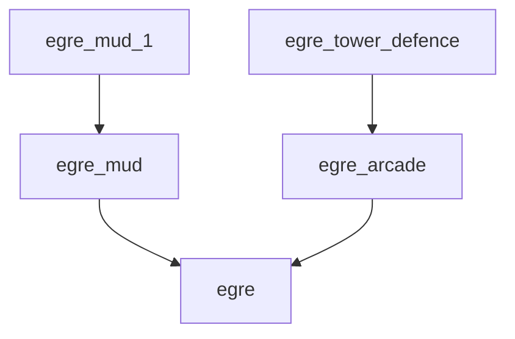
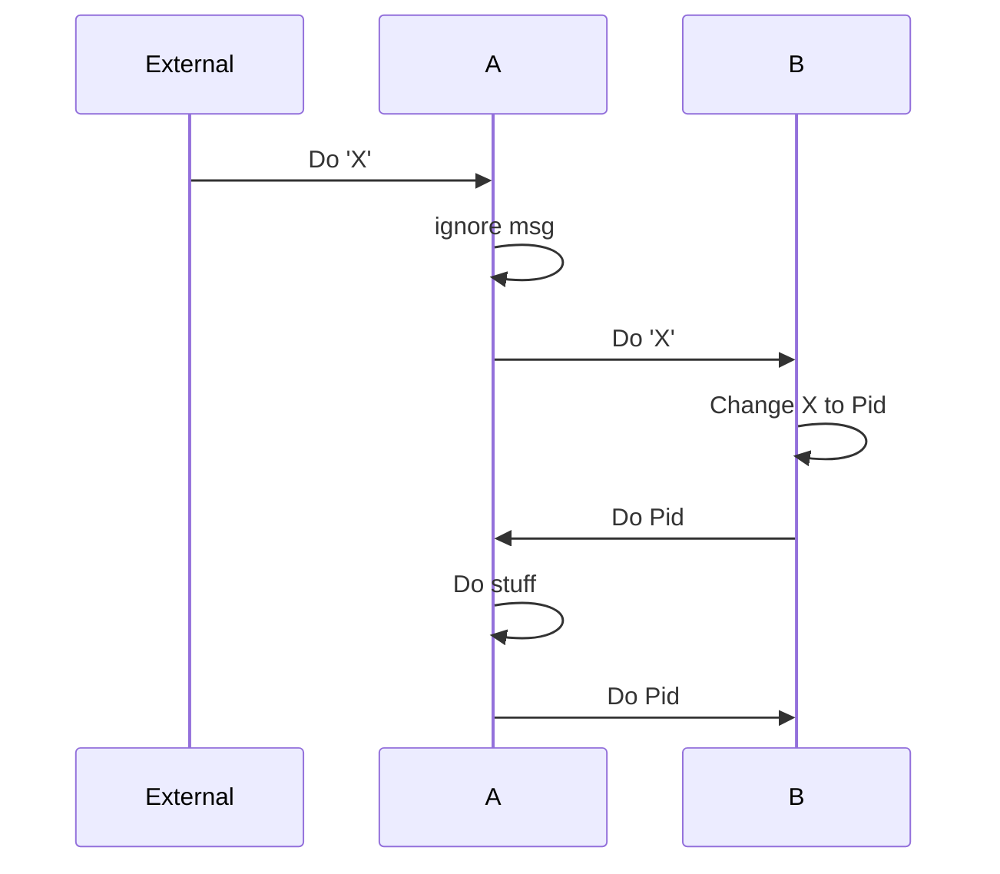

# **EGRE** - **E**rlang **G**raph **R**ules **E**ngine

A rules engine for games.

```mermaid
flowchart TD
    em1["egre_mud_1"] --> em["egre_mud"]
    etd["egre_tower_defence"] --> ea["egre_arcade"]
    em & ea --> e["egre"]
```

## AI
No AI has been used to build EGRE, and I have no plans to use AI.

## Goals
**1)** A completely flexible MUD that can handle **any** logic.

**2)** Maximum parallelism and distribution.

## Guiding Principle
I design as if I have:
1) infinite CPU
2) infinite RAM
3) infinite bandwidth

What I'm optimizing for is flexibility in logic and distribution, not speed, memory, or communication.

## Design
In order to implement complete flexibility I decided to create a MUD where **every** element of the MUD was an independent process running concurrently with all other processes. 

**1)** **EVERY** item, player, room, attribute, context, or concept that can affect logic is its own Erlang process. Erlang processes cannot read each others' memory and can only communicate with messages.

**2)** **EVERY** process sees **EVERY** message. In order for maximum flexibility, every logical entity in the MUD needs to have the option to participate in every event. Right now processes only participate in "local" events, to limit processing requirements.

**3)** No "manager" process coordinates between processes to fetch data or handle events atomically. Processes know *NOTHING* about any other process: they know what's in their memory, and what's in the current message. If a process wants to know something it generates an event that other processes can respond to.

EGRE is a graph of asynchronous processes cooperatively handling many messages in parallel. Current messages flow through the graph concurrently and touch **one** process at a time. Each process takes in messages, modifies its internal state and triggers new messages.

### Two Phase Commit
Any message is first proposed as an `attempt` that will `succeed` or `fail`. Attempts are passed from process to process through the graph.  **Every** process can either `fail` the attempt with a `reason` or allow the attempt to `succeed`. Each process can also subscribe to the message to be notified of the result. Processes can also resend a different attempt in place of an original or pass on a modified copy of the original. If an attempt traverses all connected nodes without failing, it succeeds.

It's important to first "attempt" to process a message so that processes can mark the message as invalid before any action takes place. This is especially true for player input that makes no sense, e.g. "*go north*" when there is no north; we don't want processes reacting to the player "going north" when it wasn't possible in the first place. If a message attempt succeeds, then the player "went north"; any interested process will have subscribed to "go north" to see if it actually happens or even if it fails.

### Concurrent Processes
Messages flow through the graph without locking up other processes. Each process that handles the message will handle it independently of all other processes. A process always has the **only** copy of the message and no locks are needed. No process shall halt processing to communicate with another process. This means that all information about each message must be contained in the message itself.

Since processes do not communicate directly, and since all processes receive all (nearby) messages, any process can be added anywhere in the graph and begin to participate in every (nearby) message. Each process listens for particluar messages and so processes that cooperate to resolve a message will need to agree on a protocol to communicate via the process graph.

### No Transactions
There are no "transactions" to make sure that information is still valid by the time it is acted upon.
In a banking environment this would be a catastrophe but in a MUD this is survivable.

### Querying with Messages
To program with a graph of rule processes, processes must communicate purely with messages: if rule process A needs information, it sends out a message that requests information. Rule processes can send and receive mutliple different messages that iteratively build up into a complete message that has all the required information.

For example:

We have rule process A and B.
A gets a message attempt with "Do 'X'" and ignores it.
B gets the message.
B is triggered on "Do 'X'".
B knows that 'X' should be replaced with a pid and sends a new message "Do <pid>".
A triggers on "Do <pid>" and takes some action.

```mermaid
sequenceDiagram
    participant External
    participant A
    participant B
    External->>A: Do 'X'
    A->>A: ignore msg
    A->>B: Do 'X'
    B->>B: Change X to Pid
    B->>A: Do Pid
    A->>A: Do stuff
    A->>B: Do Pid
```

So one rule process added information to a message and resent it,
thereby triggering a another rule process that initially ignored it.

## Pros

1) **Distribution**: The objects don't need to be on the same machine.

1) **Parallelism**: Every object could potentially be handling a different message at the same time.

1) **Concurrency**: No shared memory: no message is ever modified by two processes at once. No process needs to acquire
any locks which means no deadlocks and no race conditions.

1) **Flexibility**: No explicit protocols for messages other than being a tuple. A message can be anything and any process can respond to any message.

## Cons

1) **Complexity**: since a message can be anything and every process can respond to any message, you get some wild "protocols". There's been a significant amount of working using parse transforms to document implicit protocols as "event chains".

1)  **Chaos**: logic is spread out across many different processes.

## History
The idea of a graph rules engine sprang up organically as I tried to figure out how to communicate between processes asynchronously. I stumbled upon the idea of having processes communicate by "passing notes": messages can be modified to add requests for more information and then run through the graph again. I don't call them events so as not to confuse player input, which is a message to the MUD, with an event that is caused by player input, or an event that is generated by the MUD itself.

## Historical Names
1) **erlmud**: I started this as "erlmud" but that conflicted with zxq9's Erlang MUD.
2) **GERLSHMUD**: "**G**raph of **ERL**ang **S**tream **H**andlers **MUD**": except, the processes are not handling "streams" of data; they're handling discrete messages generated one at a time.
